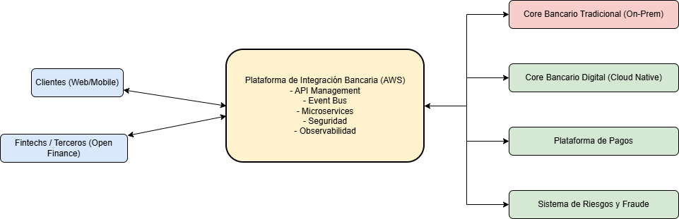
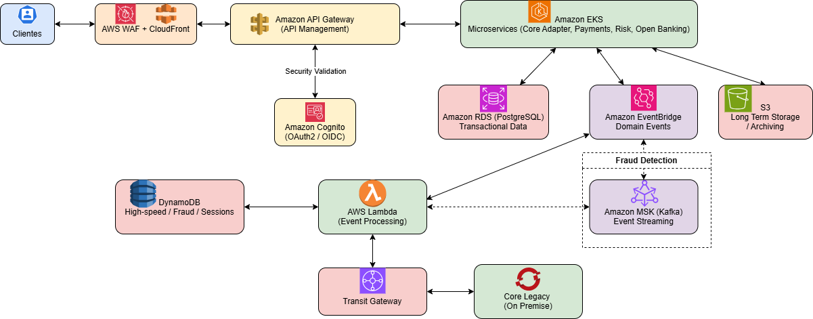
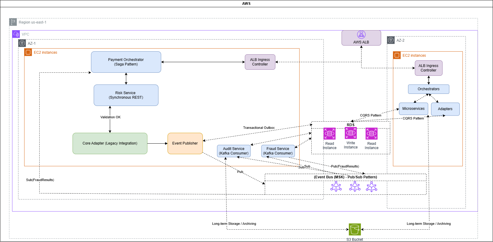

# Integration Architecture

## Banking Integration Architecture Proposal

This repository contains the architectural artifacts for the **Banking Integration Architecture Proposal**.

The complete architecture description, design decisions, and detailed explanation can be found in the document:

**PROPUESTA DE ARQUITECTURA DE INTEGRACIÓN BANCARIA.pdf**

This document provides the full architecture proposal including:

- Architecture overview
- Design principles
- Integration patterns
- Governance model
- Observability strategy
- Security considerations
- Benefits of the architecture

---

# Architecture Model

The architecture diagrams follow the **C4 Model**, which describes software architecture using different levels of abstraction.

This repository includes the following diagrams:

## 1. System Context Diagram

Provides a high-level overview of the system and its interactions with external actors and systems.

---

## 2. Container Diagram

Shows the main containers of the system such as applications, microservices, databases, and cloud services.

---

## 3. Component Diagram

Illustrates the internal components within a container and their interactions.

---

# Technologies Used

The proposed architecture is based on **AWS cloud services and modern microservices patterns**, including:

- Amazon EKS (Microservices Platform)
- Amazon API Gateway
- Amazon RDS (PostgreSQL)
- Amazon EventBridge
- Amazon MSK (Kafka)
- AWS Lambda
- Amazon S3
- Amazon Cognito
- Amazon DynamoDB
- AWS WAF + CloudFront

---

# Architecture Principles

The architecture is designed following these principles:

- Event-driven architecture
- Loosely coupled microservices
- Horizontal scalability
- High availability (Multi-AZ)
- Secure hybrid integrations
- Full observability and monitoring

---

# Observability and Monitoring

The architecture includes the following observability capabilities:

- Amazon CloudWatch
- AWS X-Ray distributed tracing
- Domain-based metrics
- Threshold-based proactive alerts
- Centralized logging using ELK Stack

---

# Author

David Guillermo  
Integration / Cloud Architecture
